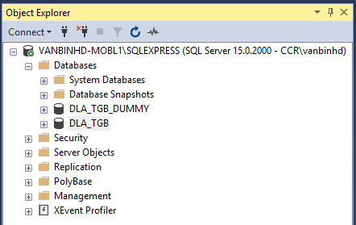
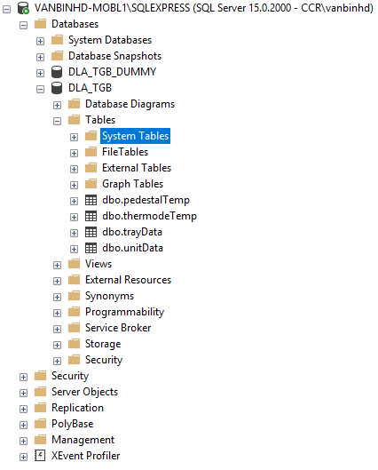
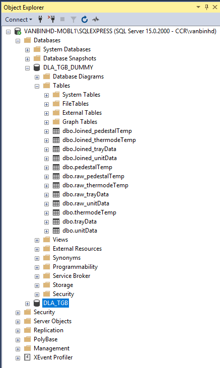

# DLA_TGB_Temperature

# SQL Server Express
1. CREATE DLA_TGB dataset on SQL Server Express

2. run SQL00.sql to create tables as below:

  - DLA_TGB
    - trayData
    - unitData
    - pedestalTemp
    - thermodeTemp
    
3. run SQL01.sql to create tables as below:

  - DLA_TGB_DUMMY
    - dbo.raw_pedestalTemp
    - dbo.raw_thermodeTemp
    - dbo.raw_trayData
    - dbo.raw_unitData
    
    

